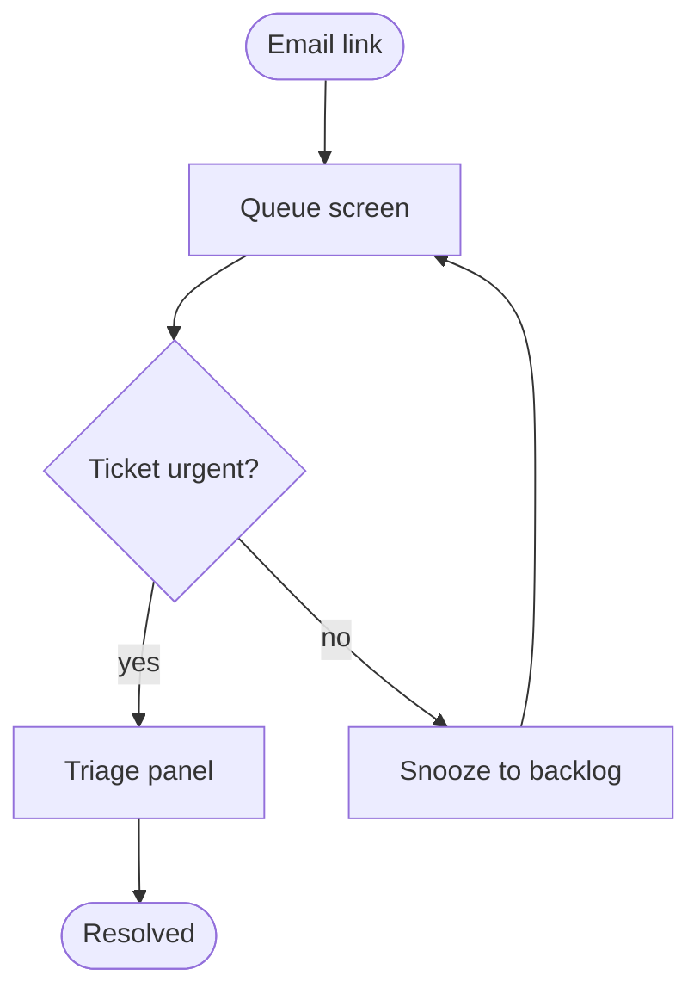
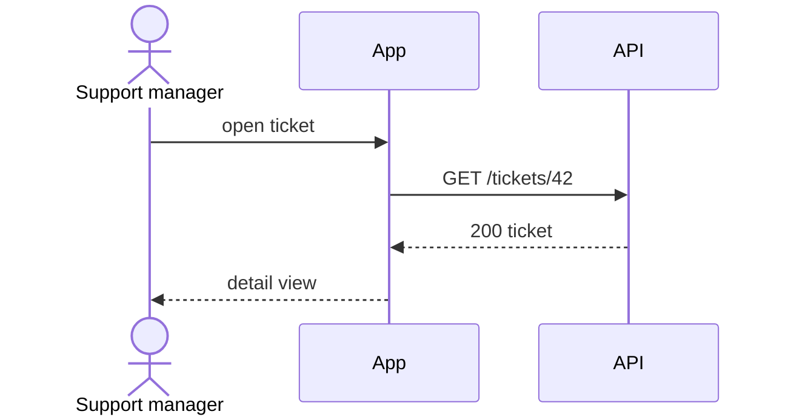
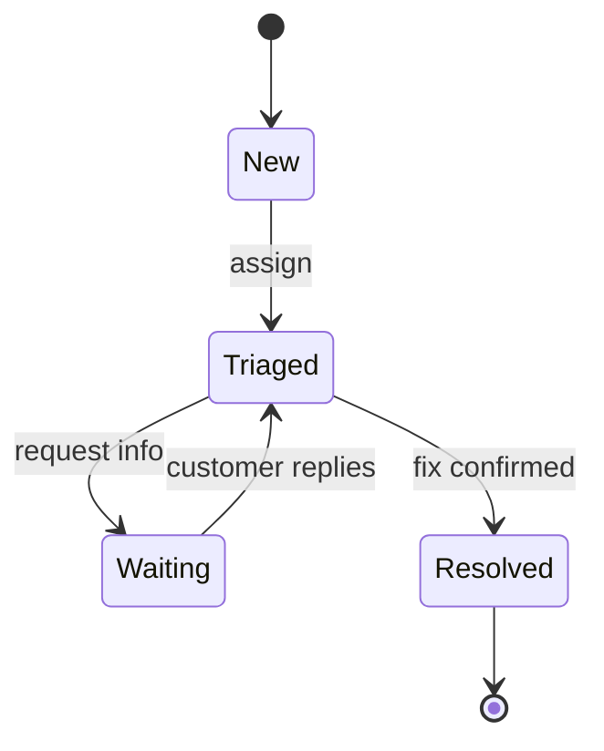
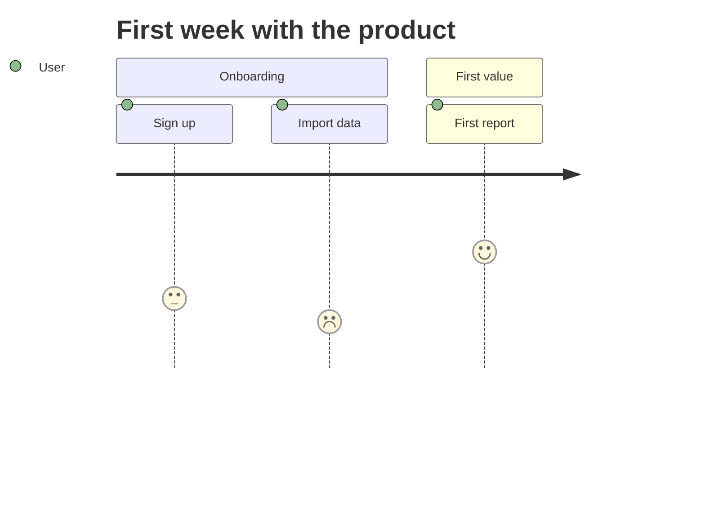
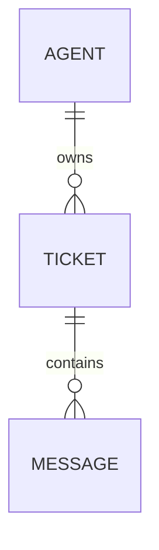
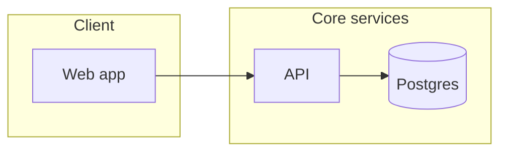

# Diagram Guide

Reference for the **Diagram** workflow (§16). Diagrams answer one question each; the
**Mermaid source is the artifact** (editable, diffable, renders in GitHub/GitLab and can
be exported to FigJam). Save sources to `design-data/projects/[project-name]/diagrams/*.mmd`.

---

## Choosing the Diagram Type

| The question being asked | Type | Mermaid keyword |
|---|---|---|
| "What are the steps / decisions?" | Flowchart | `flowchart TD` / `LR` |
| "Who talks to whom, in what order?" | Sequence | `sequenceDiagram` |
| "What states can this thing be in?" | State machine | `stateDiagram-v2` |
| "How does the experience feel over time?" | Journey | `journey` |
| "What data exists and how does it relate?" | ER diagram | `erDiagram` |
| "What are the parts of the system?" | Architecture (C4-ish) | `flowchart` + `subgraph` |
| "How is the product structured?" (sitemap) | Tree | `flowchart TD` |
| "When does work happen?" | Timeline/Gantt | `gantt` |

Don't merge questions: an architecture diagram that also shows user flow answers neither.
Split anything beyond ~20 nodes into linked diagrams.

---

## Mermaid Syntax Constraints (avoid 90% of render failures)

- **Quote any label** containing spaces + punctuation: `A["SLA breached?"]`
- **No raw parentheses, brackets, or HTML** inside node text — use quotes or rewrite
- Node IDs: short alphanumerics (`triage1`), never starting with a digit-only token
- Direction serves reading: `TD` for hierarchies/sitemaps, `LR` for processes/pipelines
- One statement per line; comments with `%%`
- Decision nodes: `{"Question?"}` with **every** branch labeled (`-->|yes|`, `-->|no|`)
- Keep styling minimal — `classDef` for at most 2-3 semantic classes (e.g., error states)

---

## Patterns Per Type

### User/task flow (flowchart)

Rules: stadium nodes `([ ])` for entry/exit, rectangles for screens, diamonds for
decisions. Every error branch must route to recovery, not dead-end (UX Flows §10 rule).

### Sequence (handshakes, API/auth flows)

Rules: name actors by role from the domain; show the unhappy path (`alt`/`else` blocks)
for at least the riskiest call.

### State machine (one object's lifecycle)

Rules: states are nouns/adjectives, transitions are events. If two states have identical
transitions, merge them.

### Journey (experience + emotion)

Scores 1-5 map to the emotion curve from `ux-flow-patterns.md` — the lowest dip is the
highest-leverage fix.

### ER (data shape)


### Architecture (subgraph flowchart)

Rules: 3 levels max (context → container → component); label edges with protocol/purpose.

---

## ASCII Wireframes (layout sketches — NOT Mermaid)

For screen-layout discussions, use box sketches inline in markdown:

```
+----------------------------------------------+
| LOGO        Queue  Reports  Settings    (Me) |
+------------------+---------------------------+
| FILTERS          |  TICKET LIST              |
| [ ] Urgent       |  +---------------------+  |
| [ ] Breached     |  | #42 Payment fails…  |  |
|                  |  | SLA ▓▓▓▓▓░░ 2h left |  |
+------------------+---------------------------+
```

Conventions: `+--+` containers, `[ ]` controls, `( )` buttons/avatars, `▓░` meters,
UPPERCASE for region names. Number regions when you'll annotate them (§17).

---

## FigJam Export

When the user wants to collaborate on the diagram visually:
1. Load the `figma:figma-generate-diagram` skill **first** (mandatory before the tool call)
2. Call the Figma MCP `generate_diagram` with the validated Mermaid source
3. Report the FigJam URL next to the saved `.mmd` source

No Figma MCP? Deliver the Mermaid source plus a note that GitHub/GitLab/VS Code render it
natively, and the per-platform MCP connection steps (workflows.md §13 fallback box).

---

## Quality Checks Before Delivering

- [ ] One question answered; title says which
- [ ] Every decision branch labeled; no dead ends without recovery
- [ ] Node labels pass the token test (domain language, not internal jargon)
- [ ] ≤ ~20 nodes; split and link otherwise
- [ ] Source saved as `.mmd`; renders without syntax errors
